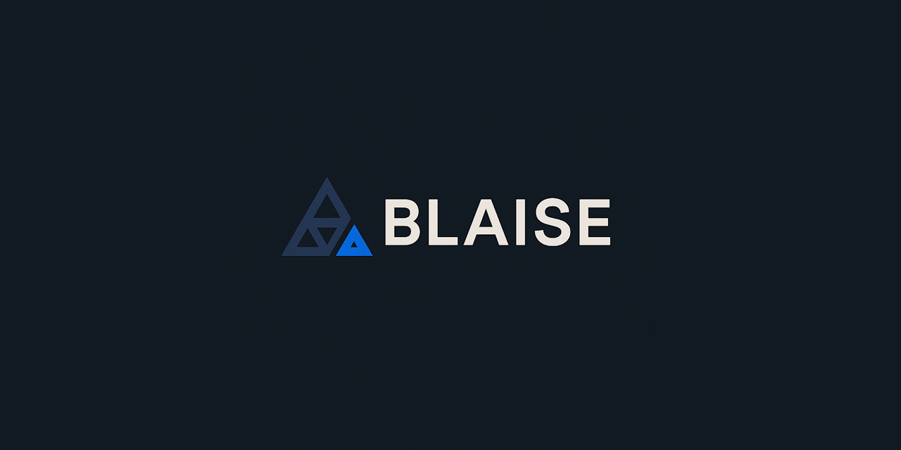

  [](https://discord.gg/tPWjMwK) [](https://bsky.app/profile/tinybiggames.com) 

# Blaise Pascal™

**Think in Pascal. Compile to C++.**

An open-source Pascal-to-C++ transpiler with perfect Delphi semantic compatibility. Self-contained distribution with bundled Zig compiler and complete runtime library.

## 🎩 Why "Blaise Pascal"?

Named after the 17th-century French polymath Blaise Pascal—mathematician, physicist, and inventor of one of the first mechanical calculators—and the programming language that bears his name. Like its namesakes, Blaise Pascal™ embodies clarity, elegance, and the marriage of theoretical beauty with practical innovation. We honor Pascal's legacy by keeping the Pascal language alive and thriving in the modern age.

## ✨ Features

- **🎯 Pascal Dialect** - A modern Pascal dialect compatible with Delphi where possible. Transpiles fundamental Pascal syntax with clean, predictable C++ output. Best thought of as its own flavor of Pascal optimized for C++ compilation.

- **⚡ Modern C++23** - Generates clean C++23 code with modern LLVM backend. Leverages spaceship operator, std::format, and std::println for optimal performance.

- **🏗️ Smart Architecture** - Dumb transpiler, smart runtime. Simple token mapping keeps the transpiler maintainable while a sophisticated runtime preserves exact Pascal semantics.

- **📦 Self-Contained** - Everything included - Blaise transpiler, Zig compile, and complete runtime library. Just unzip and go, no additional downloads needed.

- **🌍 Cross-Platform** - Compile for Windows, Linux, and macOS from any platform using bundled Zig build system with consistent behavior everywhere.

- **🔒 Zero Conflicts** - All runtime code in `bp` namespace with fully-qualified names. Perfect isolation from external libraries like raylib, SDL, OpenGL.

## 🚀 Quick Start

### 1. Download & Extract

Download the latest release and extract to any directory. Everything you need is included:
- `Blaise.exe` - The transpiler
- `bin/res/zig/` - Zig compiler with LLVM
- `bin/res/runtime/` - C++ Pascal runtime library

### 2. Create a New Project

```bash
# Create a new program project
blaise.exe init MyProgram

# Or create a library project
blaise.exe init MyLib --template library
```

### 3. Write Your Pascal Code

Edit the generated source file in `src/MyProgram.pas`:

```pascal
program MyProgram;
begin
  WriteLn('Hello from Blaise Pascal!');
end.
```

### 4. Build & Run

```bash
# Navigate to your project directory
cd MyProgram

# Build the project (transpile + compile)
blaise.exe build

# Run the compiled executable
blaise.exe run
```

## 📝 Usage

### Basic Commands

```bash
blaise init <name> [--template <type>]  # Create new project
blaise build                             # Build project
blaise run                               # Run executable
blaise clean                             # Clean build artifacts
blaise zig <args>                        # Pass args to Zig compiler
blaise version                           # Show version
blaise help                              # Show help
```

### Project Templates

- `program` - Executable program (default)
- `library` - Shared library (.dll on Windows, .so on Linux)
- `unit` - Static library (.lib on Windows, .a on Linux)

## 🎛️ Compiler Directives

Control your build settings using compiler directives in your Pascal source:

### Cross-Platform Compilation

```pascal
{$TARGET x86_64-linux}
program MyProgram;
begin
  WriteLn('Cross-platform!');
end.
```

**Supported targets:**
- `{$TARGET x86_64-windows}` - Windows 64-bit
- `{$TARGET x86_64-linux}` - Linux 64-bit
- `{$TARGET aarch64-macos}` - macOS ARM64
- `{$TARGET native}` - Current platform (default)

### Optimization Levels

```pascal
{$OPTIMIZATION Debug}        // Debug build (default)
{$OPTIMIZATION ReleaseSafe}  // Safe optimized build
{$OPTIMIZATION ReleaseFast}  // Fast optimized build
{$OPTIMIZATION ReleaseSmall} // Size optimized build
```

### Application Type (Windows)

```pascal
{$APPTYPE GUI}      // No console window
{$APPTYPE CONSOLE}  // Console application (default)
```

### External Libraries

```pascal
{$INCLUDE_HEADER <raylib.h>}
{$LIBRARY_PATH .\lib}
{$LINK raylib.lib}
```

## 🏗️ Architecture

### THE LAW

```
╔═══════════════════════════════════════════════════════════════╗
║                                                               ║
║  WRAP EVERYTHING THAT CAN BE WRAPPED IN THE C++ RUNTIME       ║
║                                                               ║
║  Make the transpiler DUMB.                                    ║
║  Make the runtime SMART.                                      ║
║                                                               ║
║  All runtime lives in namespace bp { ... }                    ║
║  ALWAYS use fully-qualified names: bp::Integer, bp::WriteLn   ║
║  NEVER use 'using namespace bp;'                              ║
║                                                               ║
╚═══════════════════════════════════════════════════════════════╝
```

### Three-Layer Design

```
Pascal Source (.pas)
        ↓
    DelphiAST (parsing)
        ↓
  Blaise Transpiler (token mapping)
        ↓
  Generated C++23 (.cpp)
        ↓
    Zig/LLVM (compilation)
        ↓
   Native Executable
```

**The transpiler is a dumb token mapper** - It walks the AST and maps Pascal tokens to C++ tokens with `bp::` prefixes. That's it.

**All semantic complexity lives in the C++23 runtime** - The `bp` namespace contains wrapped types, operators, and Pascal RTL functions that preserve exact Pascal semantics.

## 📚 Language Coverage

### Core Types
- Integer, Cardinal, Int64, UInt64
- Boolean, Char, String (UTF-16, 1-based indexing)
- Single, Double, Extended
- Records, Enumerations
- Arrays (static & dynamic), Sets, Pointers

### Control Flow
- `if..then..else`
- `while..do`, `repeat..until`
- `for..to..do`, `for..downto..do`
- `case..of..else`
- `break`, `continue`, `exit`

### Operators
- Arithmetic: `+`, `-`, `*`, `/`, `div`, `mod`
- Comparison: `=`, `<>`, `<`, `>`, `<=`, `>=`
- Logical: `and`, `or`, `not`, `xor`
- Bitwise: `shl`, `shr`
- Set operations: `in`
- Pointers: `@`, `^`

### Program Types
- Programs (executables)
- Units (modules)
- Libraries (DLLs/shared objects)
- Uses clause, Exports clause
- Initialization/Finalization

### Exception Handling
- `try..except..end`
- `try..finally..end`
- Exception types and messages

### Runtime Library
- I/O: `WriteLn`, `Write`, `ReadLn`, `Read`, File I/O
- Strings: `Length`, `Pos`, `Copy`, `UpperCase`, `LowerCase`, `Trim`
- Conversions: `IntToStr`, `StrToInt`, `FloatToStr`, `StrToFloat`
- Math: `Abs`, `Sqrt`, `Sin`, `Cos`, `Tan`, `Round`, `Trunc`
- Memory: `GetMem`, `FreeMem`, `New`, `Dispose`
- System: `ParamCount`, `ParamStr`, `Halt`
- And much more...

## 💡 Example

**Pascal Source:**
```pascal
program Hello;
var
  name: String;
  age: Integer;
begin
  name := 'World';
  age := 42;
  
  WriteLn('Hello, ', name, '!');
  WriteLn('Age: ', age);
end.
```

**Generated C++23:**
```cpp
#include "runtime.h"

void ProgramMain() {
    bp::String name;
    bp::Integer age;
    
    name = "World";
    age = 42;
    
    bp::WriteLn("Hello, ", name, "!");
    bp::WriteLn("Age: ", age);
}

int main() {
    ProgramMain();
    return 0;
}
```

## 🔧 Advanced Usage

### Using External C/C++ Libraries

Blaise Pascal works seamlessly with external libraries thanks to the isolated `bp` namespace:

```pascal
program RaylibDemo;

{$INCLUDE_HEADER '<raylib.h>'}
{$LIBRARY_PATH .\lib}
{$LINK libraylib.a}

const
  SCREEN_WIDTH = 800;
  SCREEN_HEIGHT = 450;

begin
  InitWindow(SCREEN_WIDTH, SCREEN_HEIGHT, 'Blaise Pascal + raylib');
  SetTargetFPS(60);
  
  while not WindowShouldClose() do
  begin
    BeginDrawing();
    ClearBackground(RAYWHITE);
    DrawText('Hello from Blaise Pascal!', 190, 200, 20, LIGHTGRAY);
    EndDrawing();
  end;
  
  CloseWindow();
end.
```

### Build Configuration

Create a project-specific build configuration by using compiler directives:

```pascal
program MyGame;

{$TARGET native}
{$OPTIMIZATION ReleaseFast}
{$APPTYPE GUI}

{$INCLUDE_HEADER <raylib.h>}
{$LIBRARY_PATH .\lib}
{$LINK raylib.lib}

begin
  // Your game code here
end.
```

## 📖 Documentation

For comprehensive documentation, visit:
- [Design Document](docs/DESIGN.md) - Complete architecture and design philosophy
- [Language Coverage](docs/COVERAGE.md) - Detailed feature list
- [Examples](examples/) - Sample projects

## 🤝 Contributing

Contributions are welcome! Please feel free to submit a Pull Request.

### Development

The project is structured as follows:
- `src/compiler/` - Blaise Pascal compiler (Delphi source)
- `bin/res/runtime/` - C++23 runtime library
- `bin/res/zig/` - Bundled Zig compiler
- `examples/` - Example projects
- `docs/` - Documentation

## 📄 License

Blaise Pascal is licensed under the BSD 3-Clause License. See [LICENSE](LICENSE) for details.

## 🌐 Links

- **Website**: [tinyBigGAMES](https://tinybiggames.com)
- **YouTube**: [youtube.com/tinyBigGAMES](https://youtube.com/tinyBigGAMES)
- **Discord**: [discord.gg/tPWjMwK](https://discord.gg/tPWjMwK)
- **GitHub**: [github.com/tinyBigGAMES/BlaisePascal](https://github.com/tinyBigGAMES/BlaisePascal)
- **BlueSky**: [bsky.app/profile/tinybiggames.com](https://bsky.app/profile/tinybiggames.com)

## 🙏 Acknowledgments

- Built with ❤️ for the Pascal community
- Uses [DelphiAST](https://github.com/RomanYankovsky/DelphiAST) for Pascal parsing
- Powered by [Zig](https://ziglang.org/) and LLVM for C++ compilation

---

**Copyright © 2025-present tinyBigGAMES™ LLC. All Rights Reserved.**
